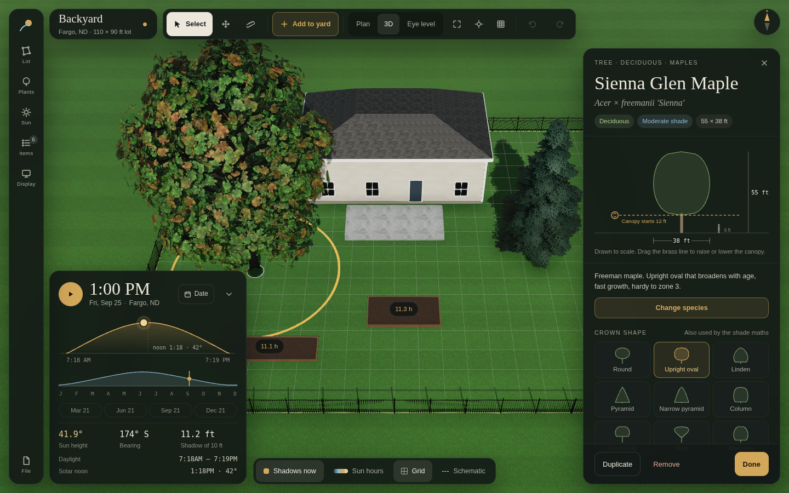
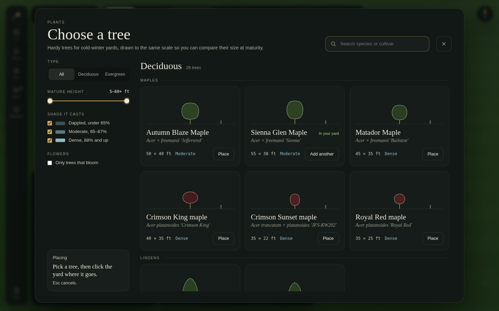
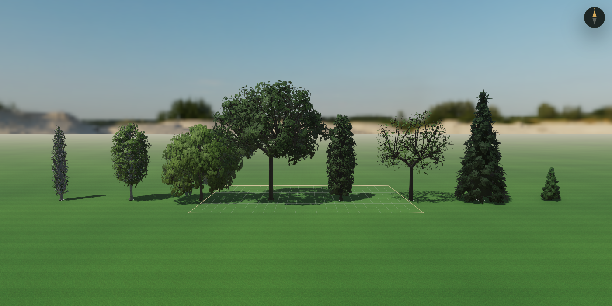
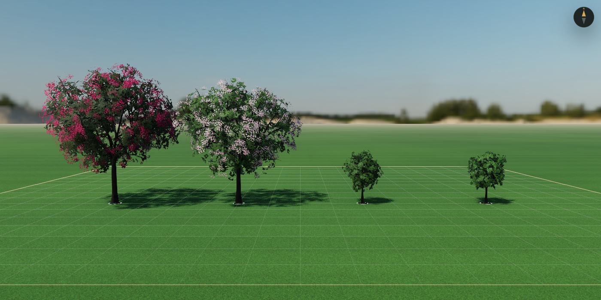
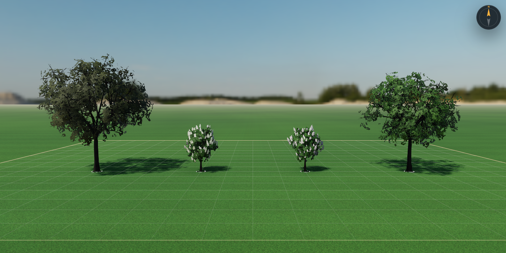
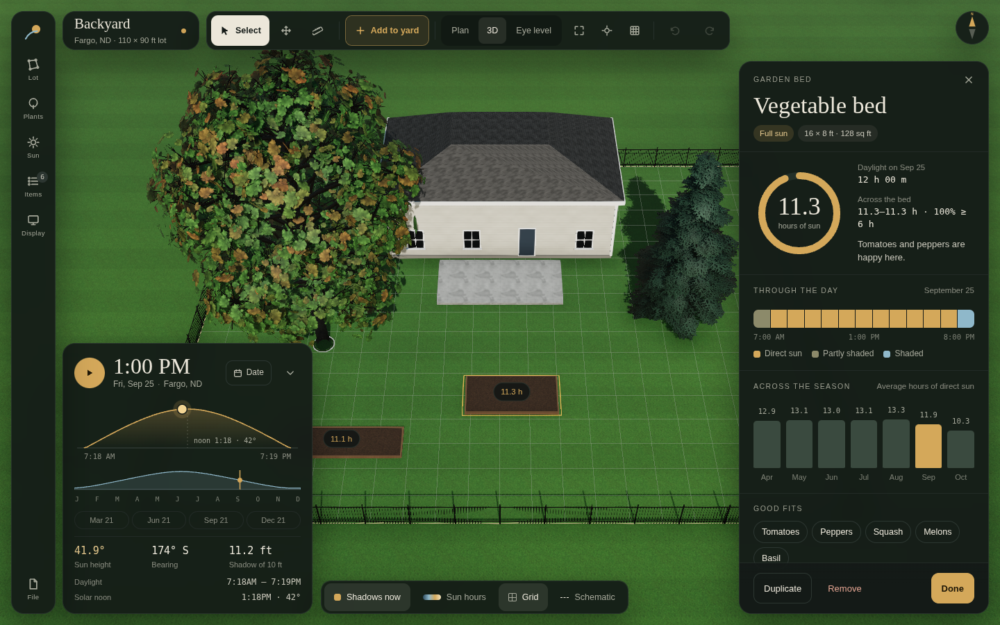

# Yard Shade Studio

Plan a yard and see where the shade falls, at any time of day, on any date, anywhere on Earth. This is the original Yard Shade Studio planner with a realistic three.js renderer underneath it.



```bash
npm install
npm run dev            # http://localhost:5173
npm run fetch-assets   # optional: 4k Poly Haven sky HDRI (~25 MB) into public/hdri
```

The original single-file app is kept for reference at `legacy/yard-shade-studio-original.html`.

## What it does

All of the original planner's features are here, in a quieter "field notebook" interface: deep green panels, ivory type, brass accents, Instrument Serif for names and Geist Mono for every number.

- **Layout:**
  - A left icon rail (Lot, Plants, Sun, Items, Display, File). Each opens a flyout panel beside it; click the same icon again to close it.
  - A project card (plan name, place, lot size, save state) and the toolbar along the top.
  - The sun card bottom-left, map layers along the bottom, and the inspector on the right while something is selected.
  - On phones the rail becomes a bottom tab bar, and panels and the inspector open as bottom sheets.
- **Toolbar:**
  - Select, pan and measure.
  - **Add to yard**: a tree from the species library, or a bed, building, deck, driveway or sidewalk.
  - Plan / 3D / Eye level, frame the lot, centre on the selection, schematic view, undo and redo. Keyboard: 1 / 2 / 3 / 0 / F / G, Esc to cancel or deselect.
- **Map layers:** shadows now, the sun-hours heat map, grid and schematic.
- **Sun card:**
  - Drag the sun arc to set the time, or play the day.
  - Pick a date, click the day-length ribbon to move through the year, or jump to a solstice or equinox.
  - Readouts show sun height, bearing, the shadow cast by a 10 ft object, daylight and solar noon.
- **Species library:** every tree drawn to the same scale.
  - Grouped Deciduous → genus (maples, lindens, birches, oaks…) and Evergreen → genus (spruces, pines, junipers & arborvitae).
  - Filter by type, mature height, shade density and flowering, or search.
  - Place one, or use it to change the species of the selected tree.
- **Tree inspector:**
  - A to-scale elevation (height, crown width, a 6 ft figure). Drag its brass line to set **canopy starts at** (ft, 0.5 ft steps). The shade engine uses it too.
  - Crown shape tiles; height, width, canopy and leaf-density sliders; evergreen.
  - A mini plan of the tree's clearance to the property lines.
- **Bed inspector:**
  - A ring gauge of sun hours against daylight.
  - Hour-by-hour sun through the day and average sun for each month of the season.
  - Plants that suit that much sun.
- **Lot & fence:**
  - A plan of the lot with side lengths and fenced sides, lot stats and size.
  - Fence style tiles showing the share of sun each blocks, fence height, density and sides.
  - House angle vs. north with a dial.
- **Also:** location and clock (see below), the heat map threshold and bare branches in the off-season, render settings, every object in the yard with its size and distance to the property line, and JSON plan files. Undo and redo keep 60 steps. You can import a property image to trace and scale the lot.

### Trees

| Group | Species |
| --- | --- |
| Maples | Autumn Blaze, Sienna Glen, Matador, Crimson King, Crimson Sunset, Royal Red |
| Lindens | Redmond, Greenspire |
| Birches | Parkland Pillar (columnar, white bark), River Birch (cinnamon bark) |
| Oaks | Bur Oak, Crimson Spire (columnar), Swamp white oak |
| Elms, hackberries, honeylocusts, alders | Prairie Expedition elm, Common Hackberry, Thornless Honeylocust (fine leaflets, dappled shade), Prairie Horizon Alder |
| Poplars & aspens | Quaking Aspen, Swedish Columnar Aspen, Hybrid Poplar, Tower Poplar |
| Willows | Weeping Willow (hanging streamers) |
| Crabapples | Prairifire, Flowering crabapple: pink-red blossoms for about two weeks from leaf-out in spring, gone by summer |
| Hydrangeas | Limelight, Pinky Winky tree forms: panicles from midsummer that go lime → white → pink into fall |
| Spruces | Norway (pendulous branchlets), Columnar Norway, Colorado Blue, Black Hills |
| Pines | Tannenbaum Mugo, Columnar Mugo, Columnar Norway Pine |
| Junipers & arborvitae | Techny and Emerald Green arborvitae (flat sprays), Spartan and Moonglow junipers |

Flowering follows the leaf-out date and the hemisphere, so blossoms appear and drop with the season you pick.







All units are feet.

## Location, clock and sun angles

The sun position comes from the original's NOAA-based solar maths. It matches suncalc to within 0.2° from Fargo to Sydney to Tromsø; the remaining difference is atmospheric refraction.

- **Location:**
  - Pick a preset, or type any latitude (−90 to 90) and longitude (−180 to 180). North and east are positive.
  - **Use my location** fills them in where the browser allows it.
- **Clock:**
  - **Time zone** (the default) uses the zone's own daylight-saving rules through the browser's time-zone data. That covers Phoenix (no DST), Europe and the southern hemisphere.
  - **Fixed UTC offset** keeps the original manual offset and its US daylight-saving switch. **Offset from longitude** suggests one.
  - If the clock is more than about 2.5 hours from what the longitude implies, the Clock section warns you, because every sun time would look wrong.
- **Edge cases:**
  - Inside the polar circles, the panel reports "Sun up all day" or "Sun below horizon all day" instead of inventing a sunrise.
  - South of the equator, leaf-out and leaf-drop dates shift six months, and the sun arcs through the north.

## Rendering

| Piece | Where |
| --- | --- |
| HDRI or physical sky. The HDRI's sun is detected, clamped out of the lighting, and rotated to the solar-maths sun, with house angle vs. north applied. | `src/scene/environment.js` |
| RenderPass → N8AO → ACES → SMAA, half-float buffers, with no tone mapping on the renderer. It switches cleanly between the perspective and plan (orthographic) cameras. | `src/post.js` |
| Procedural trees built in feet from each tree's crown shape (the same profile the shade engine uses), height, spread and density. Broadleaves fill the crown with leaf clumps on a golden-angle spiral, then grow a symmetric skeleton (trunk, scaffold limbs or central leader, branches, winter twigs) to reach them. Conifers grow in whorls with their own habits: spruce (drooping layered sprays), juniper (dense upright scale foliage with berries), pine and mugo (needle tufts, mugo multi-stemmed). Each variety grows consistently, with small per-tree variation in limbs, clump placement and crown outline so plantings don't look cloned. Foliage is a mix of small and medium leaf sprays. Interior leaves are shaded darker; fall colour starts on the sun-facing outer leaves. EZ-Tree supplies only the bark textures. | `src/trees/trees.js` |
| Buildings: foundation, corner boards, fascia and soffit, windows and a door on the wall facing the patio, generated for any outline and merged into a few draw calls | `src/app.js` (`buildingDetails`) |
| Procedural foliage per species. Broadleaf clusters: maple, linden, alder, birch, aspen, poplar, hackberry, elm, bur oak, white oak, swamp white oak, crabapple, hydrangea and general broadleaf. Also honeylocust fronds and willow streamers. Conifer sprays: spruce, juniper, arborvitae and mugo pine. Flower textures: crabapple blossoms and hydrangea panicles. Standard 1024 px, or 2048 px with High tree detail. | `src/trees/leafTextures.js` |
| Procedural lawn (blade strokes plus normal map, mowing stripes along the grid), concrete, pavers, siding and shingles | `src/scene/textures.js` |

- **Sun-hours numbers:** the original's analytic shade engine calculates them. The 3D shadows are for looking; the numbers don't depend on them.
- **Heat-map colours:** they're pre-compensated for the tone curve, so the colour ramp reads the same in the realistic and simple views.
- **Display settings** (render quality, sky and exposure) are saved per browser, not in plan files.

## Performance

- **Renders on demand.** Nothing draws unless something changes: the camera, the sun, the plan or a setting. When idle, the GPU does no work.
- **Shadows only when needed.** The shadow map re-renders only when the sun or the yard changes, never for camera moves.
- **Lighter while moving.** While you orbit, drag or play the day, frames render at 1× resolution without ambient occlusion. One full-quality frame follows when the view settles.
- **No wind and no grass geometry.** The lawn is a texture, not millions of blades.
- **Tree detail** is separate from render quality: Standard, or High (2048 px foliage and about twice the leaf sprays).
- **Render quality presets** in the Display section:

| Preset | Resolution | Ambient occlusion | Shadow map |
| --- | --- | --- | --- |
| Performance | 1× | off | 2048 |
| Balanced (default) | up to 1.5× | half resolution | 4096 |
| Quality | display resolution | full | 4096 |
